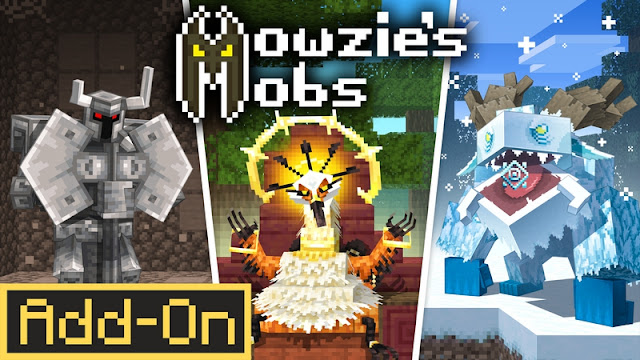
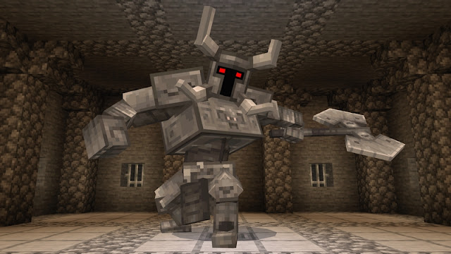
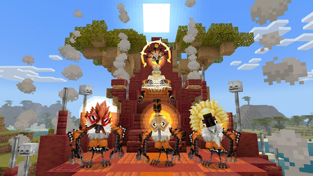
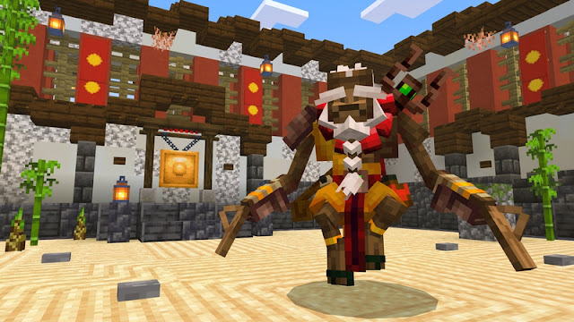
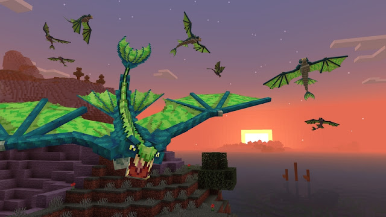
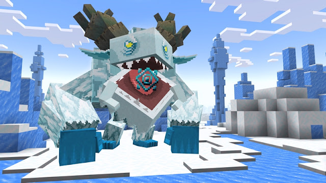

<h1>MOWZIE'S MOBS</h1>

Mowzie's Mobs is a popular Minecraft mod that adds a variety of unique, fictional creatures with custom AI, detailed animations, and specific environmental placement to the game, as well as related items, structures, and bosses for each biome. The mod enhances the gameplay by introducing new challenges and content, making exploration more engaging with distinct creatures like the jungle-dwelling Folithth and the underground Ferris Rottnot, according to the

<h1>How it work?</h1>

by adding
related items, structures, and bosses for each biome

<h1>Who Created Mowzie's Mobs</h1>

Honeyfrost

<h1>How many version are in Beyond The End</h1>

There are only 1 version

<ul>
<li>1.0</li>
</ul>
<h1>Does Mowzie's mobs have screenshot</h1>

yes here is 5 screenshot

<h1>Where is the download</h1>

here is the download
<a href="https://bedrock-hub.blogspot.com/2025/07/mowzies-mobs.html?m=1" download>download</a>

Connect in whatsapp 896-8579-977 :3

If you wanna be friend in roblox then this the link :3

<a href="https://www.roblox.com/share?code=1db53eae1e69fe4780b57f19ae388f19&type=Profile&source=ProfileShare&stamp=1757743352086" download>Connect in roblox :3</a>
if you wanna subscribe us in youtube :3

<a href="https://youtube.com/@brutal_studio?feature=shared" download>subscribe on youtube:3</a>
If you wanna connect with us in telegram here the link:3

<a href="https://t.me/+jeNobnO7N2gzZGQ1"download>Join in telegram :3</a>

